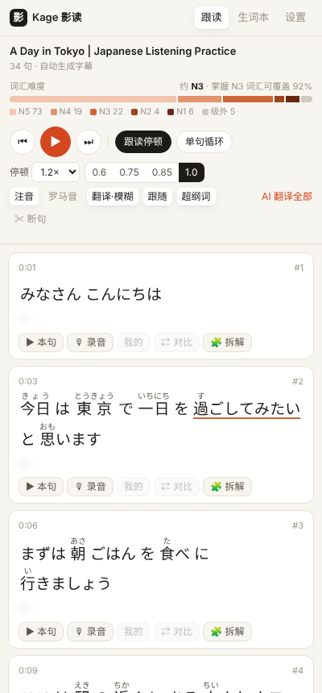
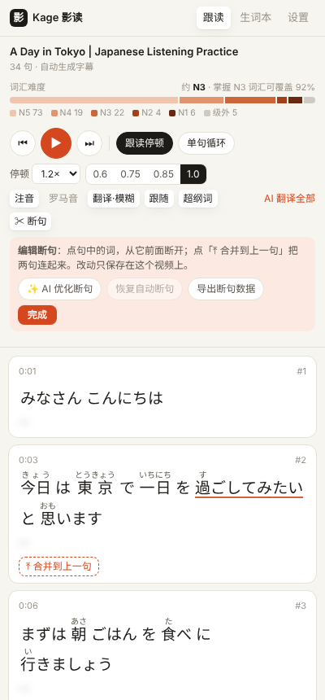
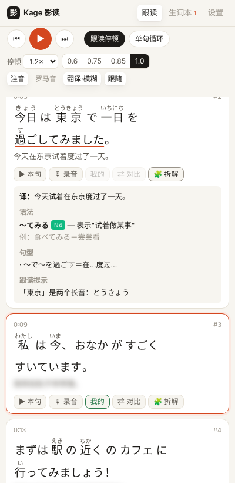

<p align="center">
  
</p>

<h1 align="center">Kage 影读</h1>

<p align="center">
  <b>把你本来就爱看的 YouTube 日语视频，变成影子跟读教材。</b><br>
  智能断句 · 自动停顿跟读 · 录音对比 · 假名注音 · JLPT 等级 · 点词即查 · AI 语法拆解
</p>

<p align="center">
  <a href="../../releases/latest"><b>⬇ 下载最新版</b></a> ·
  <a href="#安装">安装</a> ·
  <a href="#怎么用">怎么用</a> ·
  <a href="#english">English</a>
</p>

<p align="center">
  
  
  
</p>

---

## 为什么做它

市面上的影子跟读 App 大多要你在它们的内容库里学，可那些内容不一定是你想看的，也很难沉浸进去。

Kage 反过来：**你喜欢的 vlog、访谈、日剧切片就是教材**。插件只负责把它切成一句一句、能跟读、能拆解的学习卡片，就挂在 YouTube 播放页旁边的侧边栏里。

## 功能

| | |
|---|---|
| ✂️ **智能断句** | 综合停顿长短、句末形态（ます／た／ね／よ…）和跟读长度，把人工字幕和自动字幕都切成适合跟读的句子；可选 AI 补标点；断错了可以手动合并、拆开 |
| 🎧 **影子跟读** | 每句一张卡片；每句播完自动停顿（时长随句长变化），然后接下一句；单句循环；0.6–1.0× 变速 |
| 🎙 **录音对比** | 按 M 录下你的跟读，按 C 先播原声、紧接着播你的录音 |
| あ **注音 / 罗马音** | 本地分词，每个词标假名；罗马音和翻译可单独开关，翻译默认模糊，先听后看 |
| 📊 **JLPT 等级** | 内置离线等级词表：超出你水平的词自动加下划线；顶部显示整个视频的词汇难度分布和估计等级 |
| 📖 **点词即查** | 原形、读音、词性、N5–N1 等级、Jisho 词典 + AI 语境释义 |
| 🧩 **一句一拆** | AI 讲这句的语法点（标 JLPT 等级）、可套用的句型、语感和跟读发音提示 |
| ★ **生词本** | 收藏时一并保存原句和视频时间戳，可跳回原片那一秒；一键导出 Anki CSV |
| ⌨️ **全键盘操作** | 跟读时手不用离开键盘 |

完全本地运行，无账号、无服务器。AI 功能可选，用你自己的 API Key。

## 安装

> 目前还没上架 Chrome 应用商店，需要手动加载，大约 2 分钟。适用于 Chrome、Edge、Arc 等 Chromium 内核浏览器（需 114 以上版本）。

1. 到 [Releases](../../releases/latest) 下载 `kage-v0.2.0.zip` 并解压，得到 `kage` 文件夹
2. 浏览器地址栏打开 `chrome://extensions`（Edge 是 `edge://extensions`），打开右上角 **开发者模式**
3. 点 **加载已解压的扩展程序**，选中 `kage` 文件夹
4. 把黑底「影」字图标固定到工具栏
5. 打开任意一个带日语字幕的 YouTube 视频，**刷新一次页面**，点图标（或按 `Alt+K`）打开侧边栏

第一次录音时会弹出一个页面请求麦克风权限，点「允许」即可。

> 想要最新代码：`git clone` 本仓库，加载其中的 `extension/` 文件夹即可。

## 怎么用

1. 打开视频，侧边栏会自动读取日语字幕（优先用人工字幕，其次是自动生成字幕）并断句。先在「设置」里选好**你的日语水平**，比你水平难的词会加下划线
2. 点 **▶ 本句** 或按空格开始播放。默认开着「跟读停顿」：每句播完暂停，顶部进度条显示剩余跟读时间
3. 想反复练一句，打开 **单句循环**；觉得快就切到 0.75×
4. 按 **M** 录音、**C** 对比原声
5. 遇到生词就点它，看释义、加入生词本；想搞懂整句，点 **🧩 拆解**
6. 发现断句不对：点 **✂ 断句**（或按 E），点某个词从它前面断开，或者点「⤒ 合并到上一句」。自动字幕断得乱时，可以试试 **✨ AI 优化断句**

### 快捷键（焦点在侧边栏时）

| 键 | 作用 |
|---|---|
| `空格` | 播放 / 暂停（停顿中按会直接进入下一句） |
| `←` `→` | 上一句 / 下一句 |
| `R` | 重听本句 |
| `M` | 录音 / 停止 |
| `C` | 原声 → 我的录音 对比 |
| `P` | 开关跟读停顿 |
| `L` | 开关单句循环 |
| `E` | 进入 / 退出编辑断句 |
| `Alt+K` | 打开侧边栏 |

### AI 设置（可选）

在侧边栏「设置」里填写：

- **Anthropic (Claude)**：填 API Key，模型默认 `claude-haiku-4-5-20251001`，又快又便宜
- **OpenAI 兼容服务**：DeepSeek、Kimi、通义千问等都行，填 Base URL（如 `https://api.deepseek.com/v1`）、Key 和模型名（如 `deepseek-chat`）

拆解结果会缓存，同一句只调用一次。不配置 AI 也能正常使用跟读、注音、词典和生词本。

### 反馈断句问题

断句是这个插件最难做好的部分，真实视频比测试数据复杂得多。遇到断错的视频，点 **✂ 断句 → 导出断句数据**，把下载的 `kage-seg-<视频ID>.json` 附在 [Issue](../../issues) 里。这些样本会加入断句评测集，以后每次改算法都会拿它们来检验。

### 字幕说明

- 自动生成字幕没有标点，切句会粗一些；人工字幕效果最好
- 中文翻译来自 YouTube 自带的机器翻译轨；没有的话可以点「AI 翻译全部」
- 抓不到字幕时：先在播放器里手动开一次 CC，再点「重试」；或在「设置 → 字幕兜底」导入 `.srt` / `.vtt` 文件

## 隐私

不收集任何数据，没有服务器。字幕缓存和生词本只存在你的浏览器里，录音只在内存中。详见 [PRIVACY.md](PRIVACY.md)。

## 路线图

完整计划见 [ROADMAP.md](ROADMAP.md)。

- [x] **v0.2** 断句重做（句子边界打分 + 手动合并 / 拆分 + AI 补标点）· JLPT 词汇等级与视频难度条
- [ ] **v0.3** 语法地图：每句的语法标签 + 「本视频语法」总览；查词卡片里的完整变形表
- [ ] 之后：用真实反馈样本继续调断句、上架 Chrome 应用商店

欢迎在 [Issues](../../issues) 里提需求，或者分享你觉得适合跟读的频道。

## 参与开发

```bash
git clone <本仓库地址>
cd <仓库目录>
npm install      # 只用于跑测试
npm test         # 单元测试 + 断句评测（F1 低于下限会失败）
npm run bench    # 打印每份测试字幕的断句 F1，对比 v0.1 算法
npm run build    # 打包成 dist/kage-v<版本>.zip
```

改完代码后在 `chrome://extensions` 里点刷新按钮，再刷新 YouTube 页面即可。代码结构和贡献约定见 [CONTRIBUTING.md](CONTRIBUTING.md)。

## 致谢

- [kuromoji.js](https://github.com/takuyaa/kuromoji.js)：浏览器端日语分词（Apache-2.0），词典数据来自 mecab-ipadic
- [WanaKana](https://github.com/WaniKani/WanaKana)：假名与罗马音转换（MIT）
- [Jisho.org](https://jisho.org)：词典查询，数据来自 JMdict / EDRDG
- JLPT 等级：基于 [OpenJLPT](https://pypi.org/project/openjlpt/)（Jonathan Waller 的社区词表 + JMdict / KANJIDIC2），该数据文件以 CC BY-SA 4.0 分发

完整第三方许可见 [THIRD_PARTY_NOTICES.md](THIRD_PARTY_NOTICES.md)。

## 许可证

[MIT](LICENSE) © 2026 Yifei Li (李逸飞)

---

<a id="english"></a>

## English

**Kage** (影, "shadow") is a Chrome extension that turns any YouTube video with Japanese captions into shadowing practice, right in a side panel next to the player.

- **Smart segmentation**: sentence boundaries are scored from pauses, sentence-final morphology and shadowing-friendly length, for both manual and auto-generated captions. Optional AI punctuation; manual merge / split.
- **JLPT levels**: offline level table. Words above your level are underlined, and a bar shows the vocabulary difficulty of the whole video.
- **Shadowing loop**: captions are split into sentence cards. Each sentence auto-pauses for a gap proportional to its length, then moves on. Single-sentence loop and 0.6–1.0× speed are also available.
- **Record & compare**: press `M` to record yourself, then `C` to hear the original followed by your take.
- **Furigana & romaji**: offline tokenization with kuromoji.js. Translation is blurred by default so you listen first.
- **Click any word** to see its dictionary form, reading, JLPT level (Jisho), and an optional AI explanation in context.
- **Sentence breakdown**: optional, uses your own Anthropic or OpenAI-compatible API key. Covers grammar points tagged by JLPT level, reusable patterns, nuance, and pronunciation tips.
- **Word list**: saves the source sentence and video timestamp, and exports to Anki CSV.
- No account, no backend, no tracking. See [PRIVACY.md](PRIVACY.md).

**Install:** download the zip from [Releases](../../releases/latest), unzip it, open `chrome://extensions`, enable Developer mode, then click **Load unpacked** and select the `kage` folder. Open a YouTube video, refresh the page, and press `Alt+K`.

The UI is currently in Simplified Chinese. PRs for English and Japanese UI are welcome.
